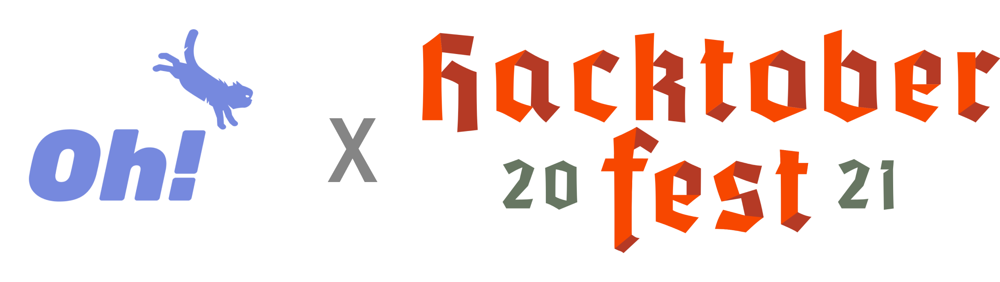

# 🌟 OhMyPet! x Hacktoberfest 2021 🌟

👉 Hacktoberfest encourages participation in the open source community, which grows bigger every year. Complete the 2021 challenge and earn a limited edition T-shirt.

👉 OhMyPet! The social network for your pet.

## Rules for contributing

+ 🛑 Please do not edit **README.md**, this will mark a valid PR.
+ 👌 You can submit a basic a project use any languages.
+ 🌟 All your code must be in your username folder

## Gettings started

👉 Clone project

```bash
git clone https://github.com/ohmypet/ohmypet-hacktoberfest-2021.git
# or
git clone git@github.com:ohmypet/ohmypet-hacktoberfest-2021.git

cd ohmypet-hacktoberfest-2021
```

👉 Create your directory related with GitHub username

```bash
mkdir [your GitHub username]
```

♥ Commit your changes for review follow the format:

```md
### Title PR
+ 🍅 Name *: The name of the author
+ 🍄 Bio: intro about you.
+ ♥ Anything about PR
```

## What is Hacktoberfest?

🍉 Hacktoberfest, in its 8th year, is a month-long celebration of open source software run by DigitalOcean.

🍎 During the month of October, we invite you to join open-source software enthusiasts, beginners, and the developer community by contributing to open-source projects.

🥰 You can do this in a variety of ways:

+ 🥐 Prepare and share your project for collaboration.
+ 🌙 Contribute to the betterment of a project via pull requests
+ 🏘 Organize an event
+ ⛑ Mentor others
+ 🤑 Donate directly to open source projects

### License

+ [Ohmypet!@MIT](./LICENSE)

`CHEERS! 🍻🥂`
